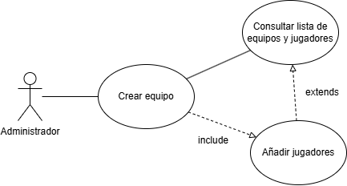
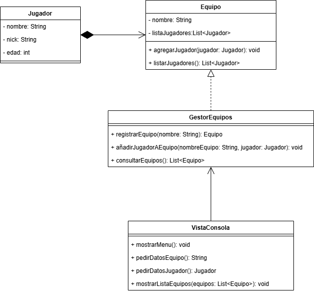

# Sistema de Gestión de Torneos de eSports

## Autor
Antonio José García Molina  
[github.com/AntonioJGM](https://github.com/AntonioJGM)

## Descripción del Proyecto
Proyecto creado para la asigantura de entornos de desarrollo del grado superior de DAW.

Este proyecto se enfoca en el diseño de un sistema de gestión de torneos de eSports. En concreto se
centra en la parte de gestión de equipos, encontramos tres funcionalidades: 

  o Registrar equipo.
  
  o Añadir jugadores a un equipo.
  
  o Consultar lista de equipos y jugadores.
  
Incluye diagramas UML y diseño modular basado en POO.

## Análisis del problema y requisitos del sistema

### Actores principales:
  •	Administrador: gestiona equipos, jugadores y torneos.
  
  •	Jugador: forma parte de un equipo.

  •	Sistema: responde a las acciones del administrador.
  
### Acciones del administrador (casos de uso solicitados):
  •	Registrar equipo.
  
  •	Añadir jugadores a un equipo.
  
  •	Consultar lista de equipos y jugadores.
  
### Relaciones entre entidades:
  •	Un equipo tiene uno o varios jugadores.
  
  •	Los jugadores pertenecen a un único equipo.
  
  •	El administrador puede crear y modificar equipos y jugadores.

## Diagrama de casos de uso
### Casos de uso incluidos:
#### Actores:
•	Administrador
#### Casos de uso:
1.	Registrar equipo
2.	Añadir jugadores a un equipo
3.	Consultar lista de equipos y jugadores
#### Relaciones entre casos:

•	“Añadir jugadores” puede incluir el caso de “Registrar equipo” si el equipo no existe aún (<<include>>).

•	“Consultar lista de equipos y jugadores” podría extender tanto a equipos como jugadores (<<extend>>).

## Identificación de clases y relaciones
### Clases principales:
#### Entidades:
##### Equipo
  o Atributos: nombre, listaJugadores
  o	Métodos: agregarJugador(), listarJugadores()
##### Jugador
  o	Atributos: nombre, nick, edad
  o	Métodos: getNombre(), getNick(), getEdad().
#### Control:
##### GestorEquipos
  o	Métodos: registrarEquipo(), añadirJugador(), consultarEquipos()
#### Interfaz:
##### VistaConsola (simulada en este ejercicio)
  o	Métodos: mostrarMenu(), pedirDatos(), mostrarEquipos()

## Diagrama de clases UML

### Equipo
  - nombre: String
  - listaJugadores: List<Jugador>
  + agregarJugador(jugador: Jugador): void
  + listarJugadores(): List<Jugador>

### Jugador
  - nombre: String
  - nick: String
  - edad: int

### GestorEquipos (controlador)
  + registrarEquipo(nombre: String): Equipo
  + añadirJugadorAEquipo(nombreEquipo: String, jugador: Jugador): void
  + consultarEquipos(): List<Equipo>

### VistaConsola (interfaz de usuario)
  + mostrarMenu(): void
  + pedirDatosEquipo(): String
  + pedirDatosJugador(): Jugador
  + mostrarListaEquipos(equipos: List<Equipo>): void

## Justificación del diseño
El sistema se divide en tres capas:
- **Entidad**: Modela los datos (Equipo, Jugador)
- **Control**: Lógica del sistema (GestorEquipos)
- **Interfaz**: Simulada con métodos de consola

Esto permite un diseño modular, lo cual permite mantener y actualizar el sistema de una forma
mucho más eficiente.

## Conclusiones
Este ejercicio ha hecho comprender mejor los diagramas de casos de uso y los diagramas de clase.
Además, me ha permitido empezar a comprender la importancia de la modularidad de los proyectos para la POO.
